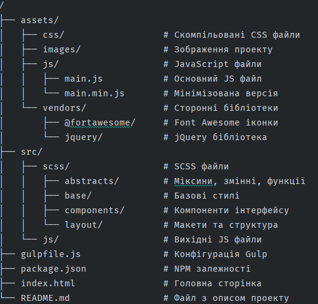

# GRID-TEMPLATE

## Опис проекту

GRID-TEMPLATE - це сучасний шаблон веб-сайту, побудований на технології CSS Grid. Проект надає гнучку структуру для створення адаптивних веб-сторінок з використанням сучасних інструментів розробки.

## Технології

Проект використовує такі технології:
- HTML5
- CSS3 (з використанням Grid та Flexbox)
- SCSS (препроцесор CSS)
- JavaScript/jQuery
- Gulp (для автоматизації збірки)
- Font Awesome (для іконок)
- Normalize.css (для нормалізації стилів)

## Структура проекту



## Функціональність
Шаблон включає наступні функціональні компоненти:
1. **Адаптивна сітка** - повністю адаптивний дизайн, що базується на CSS Grid.
2. **Навігаційне меню** - інтерактивне меню з анімованим переходом для мобільних пристроїв.
3. **Секція навичок** - демонстрація професійних навичок з візуальним представленням.
4. **Адаптивні зображення** - оптимізовані зображення для різних розмірів екранів.

## Анімації та ефекти
У проекті реалізовані наступні анімаційні ефекти:
- Анімація відкриття/закриття мобільного меню () `slideToggle`
- Візуальні ефекти при наведенні на елементи
- Плавні переходи між станами елементів

## Як використовувати
1. **Клонувати репозиторій**
``` bash
https://github.com/teresik/final_project.git

cd final_project
```
1. **Встановити залежності** (якщо ви плануєте модифікувати проект)
``` bash
npm install
```
1. **Запустити локальний сервер розробки** (за необхідності)
``` bash
gulp serve
```
1. **Зібрати проект для продакшену**
``` bash
gulp build
```
## Налаштування анімацій
Проект включає різні типи анімацій, які можна налаштувати через JavaScript:
1. **SlideToggle** - використовується для анімації навігаційного меню:
``` javascript
// Змінити швидкість та тип анімації
$(".element").slideToggle(тривалість_в_мс, "функція_згладжування");

// Приклад:
$(".element").slideToggle(300, "linear"); // 300мс, рівномірна швидкість
```
1. **FadeToggle** - анімація зміни прозорості:
``` javascript
$(".element").fadeToggle(400, "swing"); // 400мс, плавне згладжування
```
1. **Toggle** - просте перемикання видимості з анімацією:
``` javascript
$(".element").toggle(500, "linear"); // 500мс, рівномірна швидкість
```
## Підтримка браузерів
Проект підтримує всі сучасні браузери:
- Chrome (останні 2 версії)
- Firefox (останні 2 версії)
- Safari (останні 2 версії)
- Edge (останні 2 версії)

## Автори
Розроблено Даніїл Терещук Олександрович

___

© 2023 GRID-TEMPLATE. Всі права захищені.


